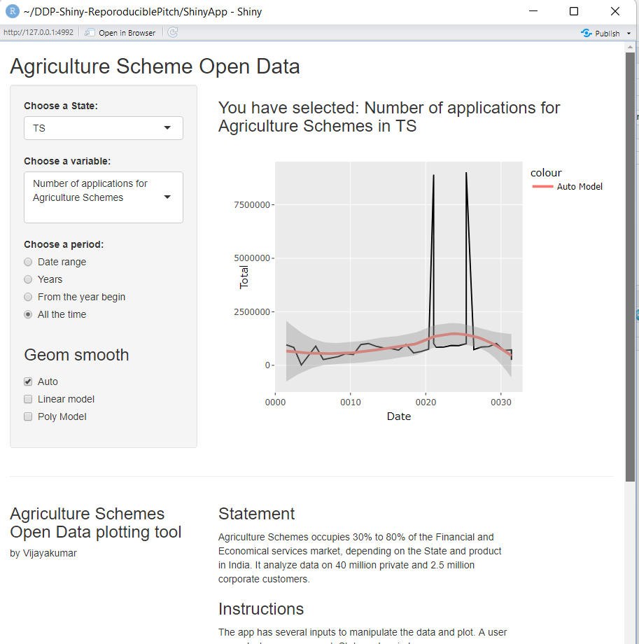
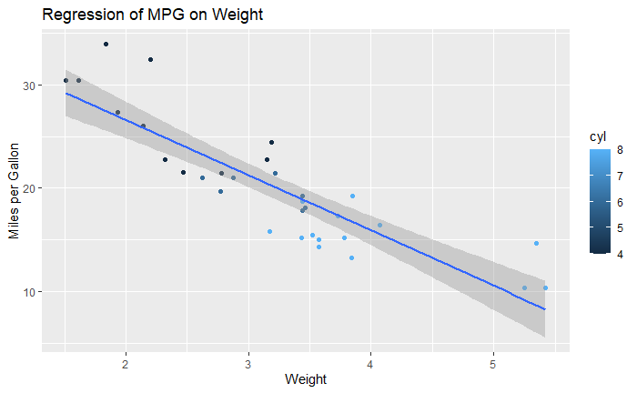

```{r setup, include=FALSE}
knitr::opts_chunk$set(echo = TRUE)
```

## Developing Data Products - Reproducible Pitch

Overview
========================================================

This presentation was prepared for the **Course Project: Shiny Application and Reproducible Pitch**

The shiny app developed for this assignment is avalilable: https://chilamkurthi.shinyapps.io/ShinyApp-ReproduciblePitch/

The source codes of ui.R and server.R and also R Presentation are available on the GitHub repo: https://github.com/chilamkurthy/DDP-Shiny-ReproduciblePitch

Agriculture Schemes occupies 30% to 80% of the financial and economical services market, depending on the State and product in India. It analyze data on 40 million private and 2.5 million corporate customers.


Available data
========================================================

* Revenue of legal entities by industries and regions
* The income level of the population - salaries, pensions, grants, allowances
* Propensity to save and consume
* Level of crediting in different regions
* Mobility of the population at home and abroad
* The share of expenses for food, housing and communal services, transport and other items

***
The app has several inputs to manipulate the data and plot. A user can select a measurement, state and period. 



How it works
========================================================

The app has several inputs to manipulate the data and plot. A user can select a measurement, state and period.
* Select a state of interest
* Select a variable (information about partial economic processes)
* Select a period of interest:
  + Date range - specifies the begining date and end dates of showing data.
  + Years - a slider that specifies the years of showing data.
  + From the year begin - a slider that specifies from the begin of which year to show the data.
  + Finally, All the time - showing the data for all the time.

The user also could select an approximation model for the showing data:
* Auto - the plot generates an approximation curve automatically
* Linear model - the plot generates Linear approximation model curve
* Poly model - the plot generates polynom model curve for the presented data

The R code
========================================================
class: small-code

In this slide we show how to include R code embedded in the slide.
As the data store in external file, let use R library.
The App uses ggplot tool for plotting the data, like following 


```{r}
library(ggplot2)
data('mtcars')

qplot(wt, mpg, data=mtcars, geom=c("point", "smooth"),
   method="lm", formula=y~x, color=cyl,
   main="Regression of MPG on Weight",
   xlab="Weight", ylab="Miles per Gallon")
```


